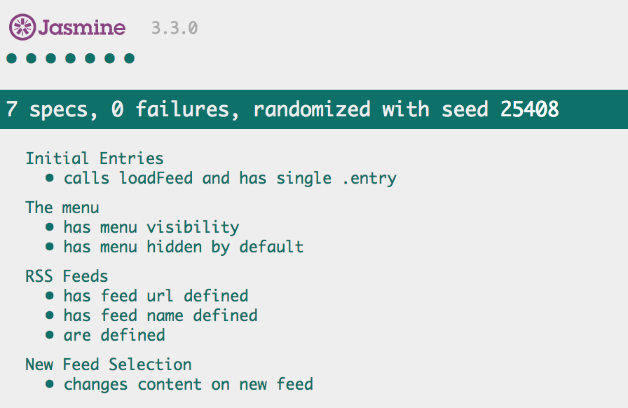

# Feed Reader Project
The purpose of the project is to understand the concepts of test-driven development using Jasmine library. 

## Table of Contents

- [Instructions](#instructions)
- [How to view Jasmine results](#how-to-view-jasmine-results)
- [Demo](#demo)
- [Contributing](#contributing)


## Instructions
To clone this repository
```
git clone https://github.com/rajashekar/feedreader.git
```

Go to feedreader directory
```
cd feedreader
```

Open `index.html` in any browser (drag and drop index.html in browser)

## How to view jasmine results

- Go to end of the page to view the test cases done for fead reader.
- Refer below screenshot :point_down: for all test cases executed for feed reader.

## Demo



## Contributing

This repository is done as part of Udacity Front end Web developer Feed reader project. Therefore, we most likely will not accept pull requests.
